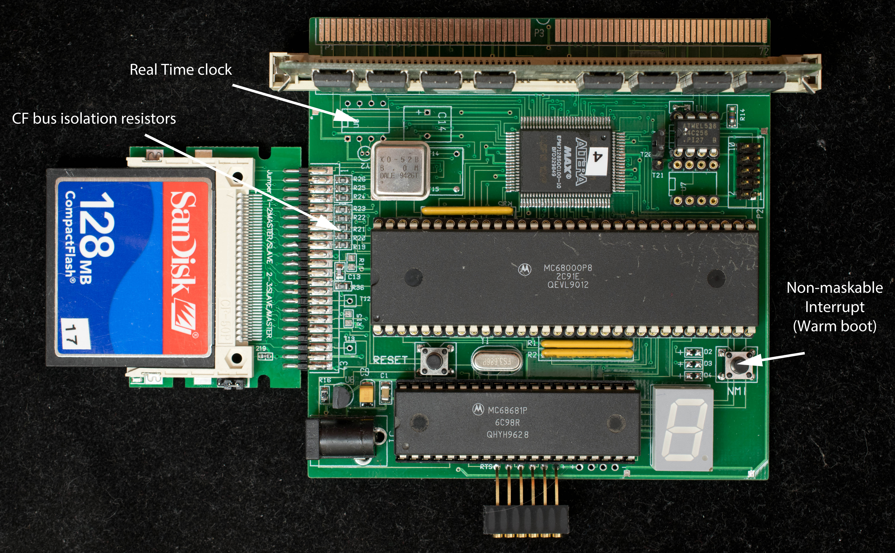

# Tiny68K
Tiny68K is a high-performance yet low-cost single board computer based on the Motorola 68000.

### Features
- Motorola 68000 CPU
- MC68681 DUART, port A is the console operating at 38400 baud, 8N1, with CTS/RTS hardware handshake.
- Altera EPM7128 CPLD contains the glue logics:
  -  State machine to load 32K serial flash when powered up or with a reset,
  -  DRAM controller for a 16-megabyte SIMM72 DRAM module,
  -  Hidden CAS-before-RAS refresh in hardware, no software overhead required,
  -  memory decoder,
  -  Interrupt controller,
  -  Bus Error watchdog timer,
- 8-16 MHz 0scillator (only 8 MHz operation is tested)
- 32Kbyte serial flash, 24C256 as the boot device.
- Second 32K serial flash that can be programmed in situ and serves as the boot device with just one jumper change.
- 44-pin edge connector interfaces to a low-cost IDE-CF module
- SIMM72 socket to accommodate a 16-megabyte SIMM DRAM module
- SIMM72 expansion port (currently not tested)
- 7-segment LED display as visual indicator of board operations.
- Target for CP/M-68K ver 1.3
- 100mm x 100mm 2-layer pc board
- 5V operation

Tiny68K has two unusual features:

- The entire 16-megabyte memory space of 68000 (except the top 32Kbyte of I/O space) is filled with RAM,
- The boot software residesin a 32Kbyte serial flash that is copied into the lowest 32Kbyte of the DRAM when powered up or with a reset. The RAM-resident boot software can be modified just like any data in RAM but is overwritten on the next power cycle or with a reset.

### Descriptions
Low cost without sacrificing performance is the design goall of Tiny68K. Cost control is achieved by:

- Two-layer PC board in 100mm x 100mm format. Many board manufacturers only charge 50 cents per board in quantity of 10 in this format,
- Memory in the form of surplused 72-pin SIMM 16-megabyte DRAM modules. Such modules can be purchased for $2-3 each on eBay,
- Low cost 5-Volt CPLD, Altera EPM7128, that is about $2-3 each from China,
- Use low-cost serial flash memory as the boot memory,
- Interface via pc board edge connector to a low-cost 44-pin IDE-CF module,
- No on-board RS232 transceiver because most USB-based serial port modules operate at the TTL level.
  
Good performance is maintained by:

- 16-bit wide data bus,
- 16-megabyte SIMM72 DRAM operating at zero wait state (at 8MHz system clock),
- Fast serial flash loads monitor in 0.6 second after a reset or power on,
- 16-bit wide bus-connected IDE interface operating with zero wait state at 8MHz,
- Hidden CAS-before-RAS refresh cycle with no software overhead.
  
Memory map

- RAM is from 0x0 to 0xFF7FFF,
- Serial Flash is from 0xFFD000-0xFFDFFF
- IDE-CF is from 0xFFE000-0xFFEFFF
- 68681 DUART is from 0xFFF000-0xFFFFFF

### Design Files

- [schematic](tiny68k_rev2_scm.pdf), the schematic and board layout tools are IVEX's WinBoard and WinDraft (ver 2.05)
- [gerber photo plots](tiny68k_r2_gerber.zip), pc boards were manufactured by SeeedStudio
- Part list
- Altera [EPM7128 design files](tiny68k_rev2_CPLD_rtc_en_0_wait.zip). Designs are created in Quartus 8.1, should be compatible with later version of Quartus. Designs are entirely in schematics. [CPLD schematic in PDF](tiny68k_rev2_cpld_PDFschematic_rtc_en_0_wait.pdf) format. [Programming binary](tiny68k_rev2_cpld_program_binary.zip) in .pof format.
- Tiny68K Monitor debugger. The software is developed in the EASy68K tool chain. File with .bin extension is the programming binary for serial EEPROM programmer (CH341).
- 
